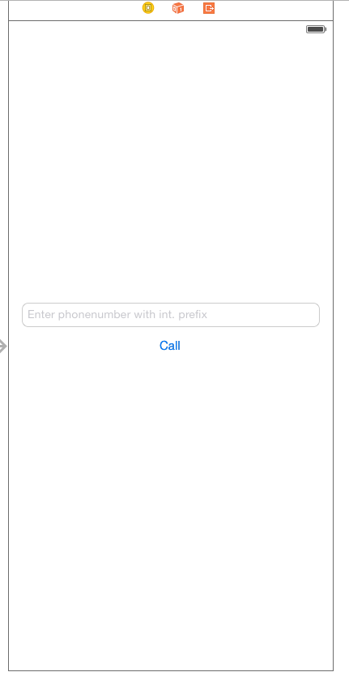

# iOS App to Phone Tutorial

In this tutorial you will learn how to use the Sinch SDK to make a voice call from an iOS app to a regular phone number. This will take about 20 minutes to build, and will require:
* Xcode
* An understanding of ObjectiveC
* Another phone to call to (any mobile with a regular phone number)

##Start

If you don't have an account with Sinch, sign up for one at [http://www.sinch.com/signup](). Set up a new application using the dashboard, and take note of your application key and secret. Next:

* Launch Xcode and create a new project (File>New>Project)
* Select 'Single View Application' and click next
* Name the project 'CallingApp' and save it

The easiest way to add the Sinch SDK is to use CocoaPods. Open a terminal window in your Xcode project directory, create a Podfile with the content below.

```pod init```

Open the podfile and add below.

```
pod 'SinchRTC'
```

Save the file, in the terminal window type.

```pod install```

Note: If you are new to CocoaPods go to [cocoapods.org](http://cocoapods.org/) to learn how to install it.

Last thing you have to do is to set the architectures settings on your project and the pod project to `armv7` and `armv7s` (We are launching 64bit support in a couple of weeks).


##Setting up the client
Open the Main.storyboard in Xcode and add a textfield and a button. Set the text of the button to "Call".



Add outlets and actions in ViewController.h like this:

```objectivec
@property (weak, nonatomic) IBOutlet UITextField *phoneNumber;
@property (weak, nonatomic) IBOutlet UIButton *callButton;
- (IBAction)call:(id)sender;
```

Also add an import to the Sinch client in your ViewController.h

```#import <Sinch/Sinch.h>```

Then, in ViewController.m find `- (void)viewDidLoad`, and add after `[super viewDidLoad];`. Here is what your code should look like:

```
- (void)viewDidLoad
{
    [super viewDidLoad];
    [self initSinchClient];
}
```

Add instance variables to ViewController.m

```
@interface ViewController ()
{
    id<SINClient> _client;
    id<SINCall> _call;
}
@end
```

and synthesize the properties, by adding `@synthesize phoneNumber, callButton;`

Create a method call `initSinchClient`, add your application key and secret, and set the username to anything you want. In this tutorial we are not going to have any login functionality, as this is just a basic calling app skeleton.

```
-(void)initSinchClient 
{
    _client = [Sinch clientWithApplicationKey:@"your_key"
                            applicationSecret:@"your_secret"
                              environmentHost:@"sandbox.sinch.com"
                                       userId:@"anything you want"];
    _client.callClient.delegate = self;
    [_client setSupportCalling:YES];
    [_client start];}
```

As you can see you have a warning now, lets fix that by adding the SINCallClientDelegate to the ViewController.h file 

`@interface ViewController : UIViewController
<SINCallClientDelegate>`

For those of that have followed the [iOS app to app calling tutorial](https://www.sinch.com/tutorials/ios-simple-voice-app-tutorial/), you might notice that we are not listening to active connections with `[_client startListeningOnActiveConnection]`, and that is because it's not necessary when you only want to make PSTN calls and outgoing calls. 

Also, if you do not start an active connection, this will save you money. 

This all the setup needed to make PSTN (app to phone) calls. Next, we will implement a placing the call functionality.

#Making a call 
Change the `call:` action to look like this 

```
- (IBAction)call:(id)sender {
    if (_call == nil)
    {
        _call = [[_client callClient] callPhoneNumber:phoneNumber.text];
        [callButton setTitle:@"Hangup" forState:UIControlStateNormal];
    }
    else
    {
        [_call hangup];
        [callButton setTitle:@"Call" forState:UIControlStateNormal];
    }
    
}
```

What we are doing here is changing the functionality to either call or hang-up.

And that’s it for making a call. For a production app, your next steps would be to implement the `SINCallDelegate` protocol so you can make UI changes on `callDidEnd`, or `callDidEstablish`, for example.

Happy coding!

[Christian](https://www.sinch.com/author/christian/)

If you enjoyed this tutorial, take a look at our other iOS and [app calling tutorials](https://www.sinch.com/tutorials/?tags%5B%5D=app-to-app&tags%5B%5D=app-to-phone).
